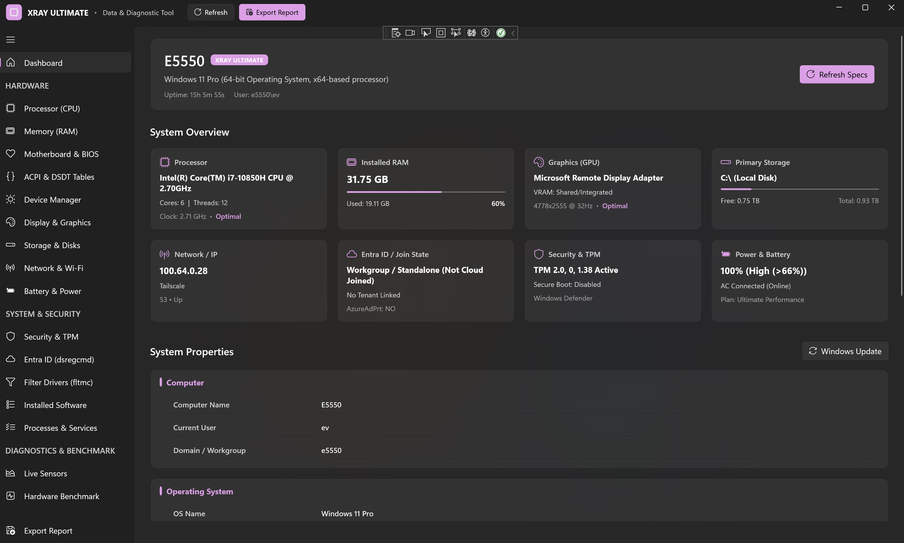

# XRAY ULTIMATE - Diagnostics & Telemetry

[-0078D6?logo=windows)](https://microsoft.com/windows)
[](https://dotnet.microsoft.com/)
[](https://github.com/microsoft/microsoft-ui-xaml)
[](https://github.com)
[](LICENSE)

**XRAY ULTIMATE** is a modern, standalone hardware diagnostics, system telemetry, and firmware exploration workstation application for 64-bit Windows environments. 

Engineered with **WinUI 3** and **.NET 10 LTS**, XRAY ULTIMATE provides deep silicon-level hardware inspection, multi-tier TPM 2.0 & Secure Boot verification, native kernel ACPI/DSDT table decompilation, real-time sensor monitoring, process & Windows service management, and audit reporting in HTML, JSON, and plain text.

---

## Screenshots & Visual Overview

### System Overview & Hardware Dashboard
*Live hardware telemetry overview showing real-time CPU, memory, GPU, primary storage, network identity, TPM security, and system properties.*



### ACPI & DSDT Firmware Explorer
*Direct physical memory AML bytecode extraction and real-time decompilation into clean, compilable ACPI Source Language (ASL / DSL).*


### Driver & System Filter Subsystem
*Inspection of registered filesystem minifilters (`fltmc`) and NDIS lightweight filter drivers with altitude mappings and instance frames.*


---

## Core Capabilities & Subsystems

| Subsystem | Description & Features |
| :--- | :--- |
| **Processor (CPU)** | Real-time microarchitecture discovery, cache hierarchy (L1/L2/L3), instruction sets (AVX-512, AVX2, SSE4.2, AES-NI, NEON), and Hyper-V/WSL2 aware VT-x detection. |
| **Memory (RAM)** | Physical SMBIOS DIMM slot mapping (DDR5/DDR4, locator, serial, rated MHz, manufacturer), paging file allocation, and memory load metrics. |
| **ACPI & DSDT Explorer** | Raw ACPI firmware tables extracted from kernel physical memory (`GetSystemFirmwareTable`). Built-in AML bytecode disassembler generating compilable ASL/DSL source code. |
| **Device Manager** | Plug-and-Play device tree grouped across 29 classes, resolving driver services, hardware IDs, and Windows error codes. Includes quick access to `devmgmt.msc`. |
| **Display & GPU** | WDDM video controllers, VRAM sizing, active resolutions, and connected monitors. Real-time dedicated GPU temperature, fan speed, and power draw telemetry via `nvidia-smi`. |
| **Storage & Disks** | Physical NVMe and SATA disk drives, SMART telemetry, logical volume allocations, and integrated shortcut to Computer Management Disk View (`diskmgmt.msc`). |
| **Network & Wi-Fi** | Interactive expandable adapter cards with inline IPv4, IPv6, Default Gateways, DNS, DHCP status, MAC, and link speed. Live Wi-Fi signal, SSID, channel, and rates with `ncpa.cpl`. |
| **Battery & Power** | Battery health percentage, cycle degradation, design vs. full charge capacity, integrated **Power Plan Switcher** (`powercfg /setactive`), plan restoration, and `powercfg.cpl`. |
| **Security & TPM 2.0** | Multi-tier TPM 2.0 presence verification, Secure Boot firmware protection status, BitLocker encryption methods, Antivirus engines, and `windowsdefender:` shortcut. |
| **Cloud Identity (Entra ID)** | Full `dsregcmd /status` diagnostic parser (Azure AD Join, Workplace Join, Tenant ID, PRT SSO token validity) and shortcut to classic Domain Join (`sysdm.cpl,,1`). |
| **Processes & Services** | Active process working sets with **Process Termination** (entire process tree), Windows Services controller (**Start, Stop, Restart, Change Startup Type**), and sorting by status/startup. |
| **Installed Software** | 64-bit and 32-bit (WOW64) installed software catalog with one-click uninstaller launching, CSV export, and shortcut to default Windows Apps (`ms-settings:appsfeatures`). |
| **Live Sensor Telemetry** | Real-time performance meters (CPU, memory, disk throughput, network bandwidth) with configurable 500 ms – 2.0 s sampling rates. |
| **Hardware Benchmark** | Multi-threaded multi-core compute stress test, memory read/write/copy bandwidth benchmarks (MB/s), and memory latency (ns). |
| **Audit Report Engine** | Exports complete diagnostics reports to **Interactive HTML** (responsive dark/light layout), **JSON** (CMDB/SIEM schema), and **Plain Text / Markdown**. |

---

## System Requirements & Prerequisites

- **Operating System**: Windows 10 (version 1809+ / Build 17763) or Windows 11 (21H2, 22H2, 23H2, 24H2).
- **Architecture**: `x64` (64-bit strictly required for kernel firmware table queries and physical device descriptors).
- **Privileges**: Administrative elevation (`Run as Administrator` / UAC prompt).

---

## Building from Source

### 1. Prerequisites
- [.NET 10.0 SDK](https://dotnet.microsoft.com/)
- [Visual Studio 2022 / 2025](https://visualstudio.microsoft.com/) with the *Windows App SDK C# Tools* workload.

### 2. Compilation Command
Always specify the explicit platform architecture parameter:
```powershell
dotnet build -p:Platform=x64
```

### 3. Running the Application
```powershell
.\bin\x64\Debug\net10.0-windows10.0.19041.0\win-x64\"XRAY ULTIMATE.exe"
```

---

## Documentation

Comprehensive technical documentation is maintained in the [`Documentation/`](Documentation/) directory:

- [**System Architecture & Runtime Model**](Documentation/Architecture.md) — WinUI 3 + .NET 10 LTS unpackaged architecture, UAC elevation, threading, and directory tree.
- [**Hardware & Telemetry Data Collectors**](Documentation/DataCollectors.md) — Detailed analysis of all 15 hardware collectors, WMI namespaces, and fallback routines.
- [**ACPI & DSDT Decompiler Specification**](Documentation/AcpiDecompiler.md) — AML bytecode parsing, package length boundary calculations, and Intel `iasl` compatibility.
- [**Audit Report Export Engine**](Documentation/ExportEngine.md) — In-process Win32 save dialogs, JSON schemas, and interactive HTML generation.
- [**UI Design System & Layout Guidelines**](Documentation/UI-Design-System.md) — Viewport standards, stretch rules, card patterns, and WinUI 3 best practices.
- [**AI Agent Development Guidelines (`AGENTS.MD`)**](AGENTS.MD) — Mandatory rules and instructions for AI agents working on this codebase.
